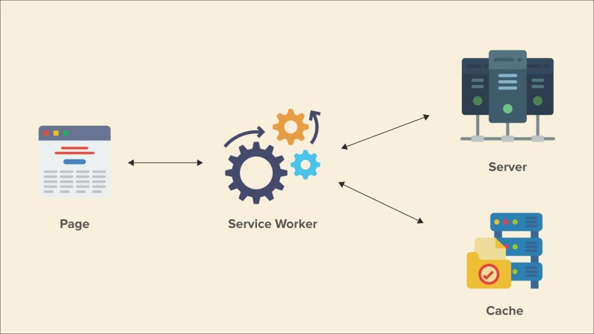

# 😌 MSW


## Service worker

JavaScript assets이며 Web Server 와 Web Browser 사이에서 프록시 처럼 동작한다.

<figure><figcaption></figcaption></figure>

* 브라우저가 백그라운드에서 실행하는 웹 페이지와는 별개로 작동하는 스크립트이며, 오프라인 문제가 생겼을 경우를 위해 등장했다.
* 오프라인 환경에서 캐시와의 상호작용, 백그라운드 동기화, 푸시알림 등의 기능을 기능한다.
* 사용자가 요청해야 동작하고 일을 마치기 전 까지 꺼지지 않는다.
* 웹페이지 밖에서 작동하기 때문에 웹브라우저의 열고 닫힘과는 무관하게 작동한다.

## MSW(Mock Service Worker)

### MSW(Mock Service Worker)란?

* API를 실제로 작동시키지 않고도 가짜값을 사용할 수 있게 하는 것을 말한다.
* 코드 레벨이 아니라 네트워크 레벨에서 가짜 구현. 오프라인 작업 등을 지원하기 위한 서비스 워커의 기능을 유용히 활용한 것이다.
* 테스트 환경(Node.js 기반) 외에 웹 브라우저도 지원하기 때문에, API 스펙은 나왔지만 아직 구현되지 않은 경우 임시로 사용할 수도 있다.&#x20;

> 단순히 임시 서버를 만들 거라면 **Express**를 쓰는 게 더 낫지만, 테스트 코드도 지원하면서 겸사겸사 웹 브라우저를 지원하는 용도라면 MSW도 괜찮은 선택이다.

### 설치법 및 세팅&#x20;

```sh
npm i -D msw
```

`jest.config.js` 파일의 “setupFilesAfterEnv” 속성에 `setupTests.ts` 파일 추가.

```javascript
module.exports = {
	testEnvironment: 'jsdom',
	setupFilesAfterEnv: [
		'@testing-library/jest-dom/extend-expect',
		'<rootDir>/src/setupTests.ts',
	],
	transform: {
		'^.+\\.(t|j)sx?$': ['@swc/jest', {
			jsc: {
				parser: {
					syntax: 'typescript',
					jsx: true,
					decorators: true,
				},
				transform: {
					react: {
						runtime: 'automatic',
					},
				},
			},
		}],
	},
};
```

### 간단한 사용 예제

`src/setupTests.ts` 파일

* beforeAll : Jest 시작할 때 맨 처음에 실행
* afterEach : 각 테스트가 끝날 때마다 실행
* afterAll : 전부 끝날 때 실행

```jsx
import server from './mocks/server';

//onUnhandledRequest API핸들러가 없는경우 에러는 발생시킴

beforeAll(() => server.listen({ onUnhandledRequest: 'error' }));

afterAll(() => server.close());

afterEach(() => server.resetHandlers());
```

`src/mocks/server.ts` 파일

```typescript
import { setupServer } from 'msw/node';
import handlers from './handlers';

const server = setupServer(...handlers);

export default server;
```

`src/mocks/handlers.ts` 파일

```jsx
import { rest } from 'msw';

const BASE_URL = '<http://localhost:3000>';

const handlers = [
	rest.get(`${BASE_URL}/products`, (req, res, ctx) => {
		const products = [
			{
				category: 'Fruits', price: '$1', stocked: true, name: 'Apple',
			},
		];

		return res(
			ctx.status(200),
			ctx.json({ products }),
			);
		}),
	];

export default handlers;
```

`App.test.ts` 파일

```

import { render, screen, waitFor } from '@testing-library/react';
import App from './App';
// jest.mock 불필요.

test('App', async () => {
	render(<App />);
	
	await waitFor(() => {
		screen.getByText('Apple');
	});
});
```

## Polyfill(폴리필)

[MDN - Polyfill](https://developer.mozilla.org/ko/docs/Glossary/Polyfill)\
[모던 자바스크립트 - 폴리필](https://ko.javascript.info/polyfills)\
[GitHub에서 만든 fetch polyfill](https://github.com/github/fetch)

* 브라우저가 지원하지 않는 자바스크립트 코드를 지원 가능하도록 변환한 코드를 말한다.
* 하위 브라우저가 지원하는 자바스크립트 코드를 사용해 자바스크립트의 최신 기능을 똑같이 구현하는 방식이다.


